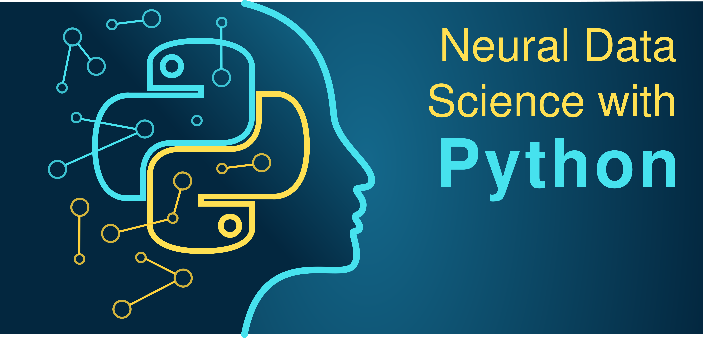
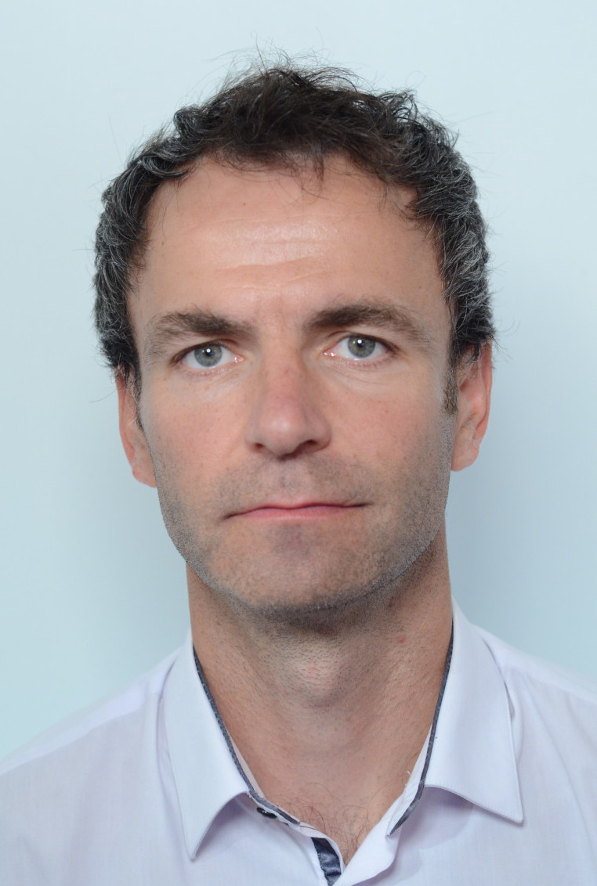

# 2024 Course : Neural Data Science with Python

This course provides a general introduction in the high-level, general-purpose porgramming lanuage [Python](https://www.python.org). 
It will furthermore cover basic analysis concepts used in the field of Neuroscience. 

### Objective of the Course 

The field of neuroscience is becoming more and more quantitative and this development is accompanied by an ever-increasing stream of data derived from the brain. It is essential that this development
is performed by neuroscientists who are ready and able to process this data. Data science is an emerging field dedicated to understanding principles in data sets. This teaching unit aims to introduce the principles of data science applied to neural data.

Concretely, *Neural Data Science with Python* teaches how to handle, analyze, visualize neural data, to create models and to run simulations of neural systems using the Python programming language. The students will acquire to use different general and specific Python modules such as numpy, scipy, matplotlib, pandas, brian and the use of the Jupyter Notebook environment. The course will be supplemented with interactive courses on [DataCamp](https://www.datacamp.com/) aimed at helping students build programming skills at their own pace. 

### Prerequisites

Bases in neuroanatomy and physiology of the central nervous system are useful. All data science- and programming concepts are introduced, explained and applied in the course. No prior knowledge in programming is required as this course is for beginners.

The below <i>resources</i> can be used for optional preparation of the course. In particular, the Python Tutorial (Online Resources) is useful for a first contact or a refresher with the programming language.  

<b>Literature Resources</b> 
The course is loosely based on the book [“Neural Data Science : A primer with Matlab and Python”](https://www.amazon.com/Neural-Data-Science-MATLAB%C2%AE-PythonTM/dp/0128040432). As in the course, the book introduces basic concepts of data analysis applied to neuroscience examples and discusses their implementation with Python (and Matlab). 

<b>Online Resources</b>
To get familiar or to recall programming concepts in Python, I recommend to use the W3Schools interactive tutorial with explanations and clarifying examples. The tutorial consists of short chapters introducing all essential basics which will be used in the course. Notably, the interactive web-programming interface allows to write and test python code. 

W3Schools - Python Tutorial : https://www.w3schools.com/python/default.asp

In particular, the following chapters are relevant for the course : 

1. Python Tutorial (https://www.w3schools.com/python/default.asp)  
   Python Intro  
   ...  
   Python Arrays

2. Numpy Tutorial (https://www.w3schools.com/python/numpy/default.asp)   
NumPy Intro  
...  
NumPy Array Filter

3. Python Matplotlib (https://www.w3schools.com/python/matplotlib_intro.asp)  
Matplotlib Intro  
...  
Matplotlib Pie Charts

### Competences Acquired

* Learning to program in Python.
* The basic principles of simple and advanced data analysis applied to neural data.
* The construction and implementation of single neuron and neural network simulations.

### What is Expected from You

* Curiosity and desire to learn.
* Active participation and contribution in particular during the tutorials.
* Feedback during the course and contributions to an open dialog to achieve on optimal learning experience.

### Basic Reference for Beginner - Cheat Sheet

This <b>cheat sheet</b> includes the python code we routinely use in the course. It provides a basic reference for beginner. 

It can be downloaded as pdf [here](miscFiles/NeuralDataSciPy_cheat-sheet.pdf).

### Lecture Organization and Material

Each course lasts for 2 hours. It consists of approximately 45 min lecture introducing the general motivation, scientific background and
analysis principles. The lecture is followed by an 1h 10 min long guided tutorial during which the programming/analysis is performed by the students based on a pre-prepared [Jupyter Notebook](https://jupyter.org). Students can follow the teachers tutorial progress in real-time on [Deepnote](https://deepnote.com/project/Neural-Data-Science-with-Python-Tutorial-DteRzlWZSbuTNmXj3nqDVA). Lecture and tutorial are separated by a short 5 min break. 

All lectures and guided tutorials take place at **9h-11h on Fridays's in room GRIGNARD F, 4th floor, 45 rue des Saints-Pères** between **September 13th and Dec 6th, 2024**.

**Lecture Overview**

| #  | Date       | Title                                                                                  | Lecturer               | Material                                                                                                                                                                                                                                                                                                                                                                                                                                                                |
|----|------------|----------------------------------------------------------------------------------------|------------------------|-------------------------------------------------------------------------------------------------------------------------------------------------------------------------------------------------------------------------------------------------------------------------------------------------------------------------------------------------------------------------------------------------------------------------------------------------------------------------| 
| 1  | Fri Sep 13 | Introduction to Python : first steps                                                   | Michael Graupner       | [Lecture L1](lectures/L1_Introduction_Python.pdf), [Tutorial T01](tutorials/T01_Python-first-steps.ipynb), See Moodle for homework, [Deepnote Link](https://deepnote.com/workspace/michael-graupner-e9d4435c-f54a-4f14-88e8-811d825c828c/project/Neural-Data-Science-with-Python-Tutorial-0ed791ce-5599-49bb-9336-65e3de7a8354/notebook/T01_Python-first-steps-80297acbac2440d38380d4086b295912)                                                                        |
| 2  | Fri Sep 20 | Time series : basic operations                                                         | Michael Graupner       | [Lecture L2](lectures/L2_Time_Series.pdf), [Tutorial T02](tutorials/T02_Time-series.ipynb), [Homework E02](exercises/E02_Time-series.ipynb), [Solutions E02](exercises/E02Solutions_Time-series.ipynb), [Deepnote Link](https://deepnote.com/workspace/michael-graupner-e9d4435c-f54a-4f14-88e8-811d825c828c/project/Neural-Data-Science-with-Python-Tutorial-0ed791ce-5599-49bb-9336-65e3de7a8354/notebook/T02_Time-series-Empty-3090a1d032da4596b2dcd2736fff2b9d)     |
| 3  | Fri Sep 27 | Wrangling Data : loading, understanding and visualizing                                | Michael Graupner       | [Lecture L3](lectures/L3_Data_Wrangling.pdf), [Tutorial T03](tutorials/T03_Wrangling-data.ipynb), See Moodle for homework, [Deepnote Link](https://deepnote.com/workspace/michael-graupner-e9d4435c-f54a-4f14-88e8-811d825c828c/project/Neural-Data-Science-with-Python-Tutorial-0ed791ce-5599-49bb-9336-65e3de7a8354/notebook/T03_Wrangling-data-Empty-4c08559929174e82bea145a7f6d5ec7f)                                                                               | 
| 4  | Fri Oct 4  | Wrangling spike trains : basic analysis, raster plot, PSTH, Poisson spike trains       | Michael Graupner       | [Lecture L4](lectures/L4_Spike-trains.pdf), [Tutorial T04](tutorials/T04_Spike-trains.ipynb), [Homework E04](exercises/E04_Spike-trains.ipynb), [Solutions E04](exercises/E04Solutions_Spike-trains.ipynb), [Deepnote Link](https://deepnote.com/workspace/michael-graupner-e9d4435c-f54a-4f14-88e8-811d825c828c/project/Neural-Data-Science-with-Python-Tutorial-0ed791ce-5599-49bb-9336-65e3de7a8354/notebook/T04Spike-trains-Empty-8537e70822ae4244bd108d14d07a5e5f) | 
| 5  | Fri Oct 11 | Bioinformatics and Systems biology I                                                   | Karine  Audouze        | see Moodle                                                                                                                                                                                                                                                                                                                                                                                                                                                              |  
| 6  | Fri Oct 18 | Bioinformatics and Systems biology II                                                  | Karine  Audouze        | see Moodle                                                                                                                                                                                                                                                                                                                                                                                                                                                              |
| 7  | Fri Oct 25 | Single neuron simulations with Brian                                                   | Marcel Stimberg        | [Lecture L7](lectures/L7_Single-neuron-simulation.pdf), [Tutorial T07](tutorials/T07_Single-neuron-simulation.ipynb), [Homework E07](exercises/E07_Single-neuron-simulation.ipynb), [Deepnote Link](https://deepnote.com/workspace/marcel-stimberg-486e6e20-59ec-4161-b083-f8adeb9a6ccf/project/T07-Single-neuron-simulations-92c1f46e-daee-4064-b3cd-151f28a975c1/notebook/Tutorial-d6f159773bcc4a60aa6b3189201f9ba8)                                                  |
|    | Fri Nov 1  | no course                                                                              |                        |                                                                                                                                                                                                                                                                                                                                                                                                                                                                         |
| 8  | Fri Nov 8  | Spiking neural network simulations with Brian                                          | Marcel Stimberg        | [Lecture L8](lectures/L8_Spiking-network-simulation.pdf), [Tutorial T08](tutorials/T08_Spiking-network-simulation_empty.ipynb), Homework, [Deepnote Link](https://deepnote.com/workspace/marcel-stimberg-486e6e20-59ec-4161-b083-f8adeb9a6ccf/project/92c1f46e-daee-4064-b3cd-151f28a975c1/notebook/T8-Spiking-network-simulations-f7a38a82623349fb9ccd7aa95641f6ad)                                                                                                                                                                                                                                                                                                                                                                 |
| 9  | Fri Nov 15 | Regression analysis : correlation analysis, logisitic regression, nonlinear regression | Michael Graupner       | Lecture, Tutorial, Homework, Deepnote Link                                                                                                                                                                                                                                                                                                                                                                                                                              |
| 10 | Fri Nov 22 | Classification and clustering : SVM, KMeans estimate                                   | Michael Graupner | Lecture, Tutorial, Homework, Deepnote Link                                                                                                                                                                                                                                                                                                                                                                                                                              |
| 10 | Fri Nov 29 | End-of-Course projects presentation; Tutorial about end-of-course projects             | Michael Graupner       | Lecture, Tutorial, Homework, Deepnote Link                                                                                                                                                                                                                                                                                                                                                                                                                              |
| 11 | Fri Dec 6  | Spectral analysis of analog signals : Fourier transform, Spectrogram, Signal Filtering | Michael Graupner       | Lecture, Tutorial, Homework, Deepnote Link                                                                                                                                                                                                                                                                                                                                                                                                                              |

### Course Evaluation

**Continuous control (50 % of the final mark) :** The students receive small **homework assignments** which are an extension of the 
in-course tutorial. The subject is related to the last course. The homeworks assignments with the respective Notebook file are posted in the **moodle** of the course. The results have **to be submitted through the moodle by Friday 9am** before the next course (e.g., the assignments of the course on Friday Sep 29th have to be submitted by Friday Oct 6th 9am). Practically, use the provided Jupyter Notebook (see table above or the moodle), add your edits to this file, and submit the modified Jupyter Notebook through the moodle.

Some homework assignments will consist in completing interactive, online assignments on [DataCamp](https://www.datacamp.com/).

**Final exam (50 % of the final mark) :** Students will receive a list of projects they will work on for an extended period of time (about 1.5 months). Projects are small programming projects aimed at independently applying analysis methods acquired during the course. The project can be worked on individually or in teams of two students. More information on the End-of-Course projects and a concrete list of available projects will be provided at due time. 

All student work - the weekly homework assignments and the End-of-Course project report - can be prepared in English or French, up to the choice of the student. 

### Accessible Computer Rooms and Account

There are three computer rooms available outside the hours of the course. The machines in these rooms feature the same Python installation as in the course and the same home directories (files stored during the course can be accessed 
from these machine) : 
*  Room **Durkheim** : left staircase from the main entrance hall to access lecture halls Delmas or balcon Binet, second floor (access code C2164). There are courses in that room during which it is not accessible.
*  Room **T209 bis** : 2nd floor, in front of Avogadro D, free access 
*  Room **T117** : 1st floor, free access 

You connect to your account on those machines - as well as on the classroom machines - with your university UID as login.  The password is your full student number. It is highly recommended to change the default password, 
which can be done with the command `passwd` in a command line terminal. Please contact [Benoit Greff](mailto:benoit.greff@parisdescartes.fr) 
or [Luc Tamisier](mailto:Luc.Tamisier@parisdescartes.fr) in case of problems with the machines or your account. 

### Identification

M1 S1 Neuro

Code UE : NS0AM020

Acronym : DataSciPython

ECTS : 3

Time volume : 24 hours

### Language of the Course 

The dominant teaching language of the course with be English, while the lecturers provided by Karine Audouze will be in French with slides and material in English. 

### Course Organizers and Teachers  

The course is organized by [Michael Graupner](mailto:michael.graupner@parisdescartes.fr). Lectures will furthermore be taught by [Karine Audouze](mailto:audouze.p7@gmail.com), and  [Marcel Stimberg](mailto:marcel.stimberg@inserm.fr). All questions regarding access to your university account can be addressed to  [Luc Tamisier](mailto:luc.tamisier@parisdescartes.fr) or [Benoit Greff](mailto:benoit.greff@parisdescartes.fr).

Please direct all basic inquiries to [Michael Graupner](mailto:michael.graupner@parisdescartes.fr) by email or pass by his office : 

> Saints-Pères Paris Institute for the Neurosciences  
> CNRS UMR 8003, Université de Paris  
> bureau : H 358  
> 45 rue des Saints Pères  
> 75270 Paris Cedex 06  
> France

**Overview of all Lecturers**

| Picture                                               | Name                 | Email                                                                | Address                                                                                          | 
|-------------------------------------------------------|----------------------|----------------------------------------------------------------------|--------------------------------------------------------------------------------------------------| 
|       | Karine Audouze       | [audouze.p7@gmail.com](mailto:audouze.p7@gmail.com)                  | Université Paris Cité, Systems Toxicology Group, 45 rue des Saints-Pères, 75006 Paris            |
|       | Marcel Stimberg      | [marcel.stimberg@inserm.fr](mailto:marcel.stimberg@inserm.fr)        | Institut de la Vision, Computational Neuroscience of Sensory Systems, 17 rue Moreau, 75012 Paris |
|  | Michael Graupner     | [michael.graupner@u-paris.fr](mailto:michael.graupner@parisdescartes.fr) | Université Paris Cité, SPPIN, 45 rue des Saints-Pères, 75006 Paris                               |

### Python Requirements

All course material will run smoothly on the classroom machines, which will have all the required modules installed. 

In case you want to run the course material on your private computer, the following packages are required : 
* Python 3.8 (or the common versions 3.7, 3.8, 3.9)
* numpy
* scipy
* jupyter
* matplotlib 
* pandas
* xlrd 
* biopython
* scikit-learn
* [Brian2](http://briansimulator.org/)

We will set up a Python programming party in the beginning of the academic year for all students who are interested in installing the Python environment required for the class on their laptops. 

Find [here](lectures/PythonInstallation.pdf) the slides with details of the Python installation. 

### External Resources

This class is supported by , an intuitive learning platform for data science and analytics. For education, Datacamp provides courses for free. We have arranged for you to have access to these courses while you are enrolled in the ***Neuroscience Master*** of the Université de Paris.

This class is also supported by , a new kind of data science notebook : Jupyter-compatible with real-time coding and running in the cloud. The ***Neural Data Science with Python*** class profits from the free education plan of Deepnote. 

### Licence 

See the [LICENSE](LICENSE) file for license rights and limitations (Attribution 4.0 International). 